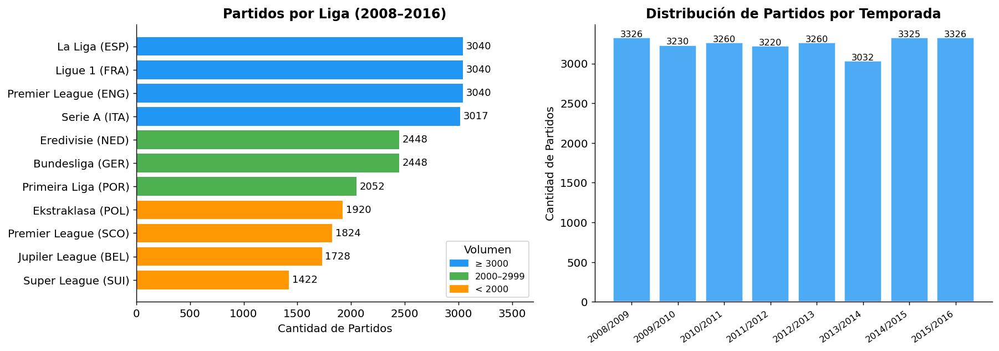
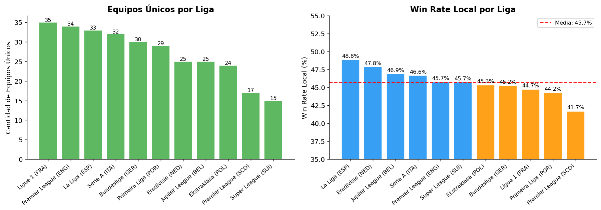
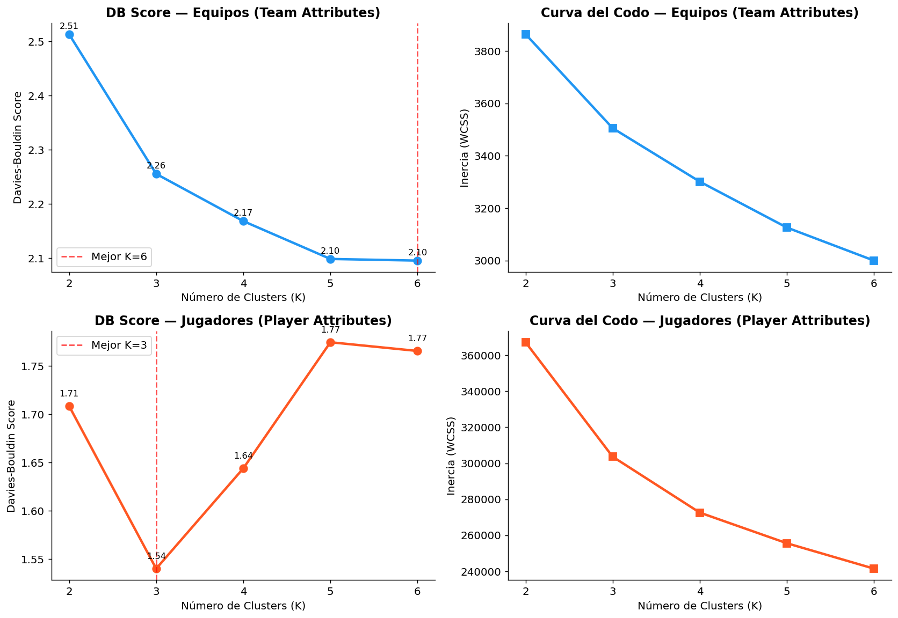
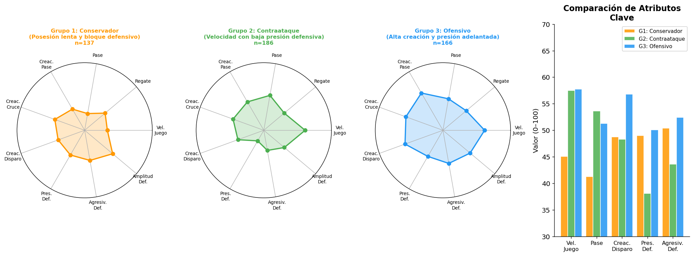
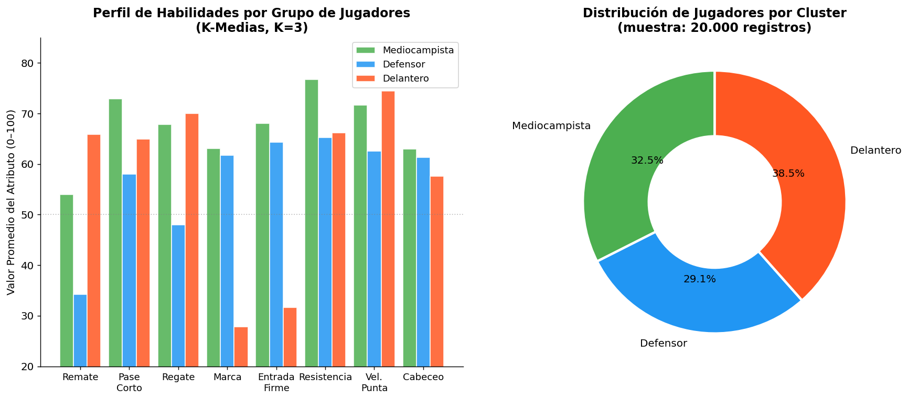
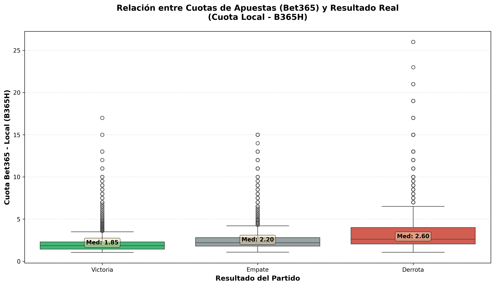
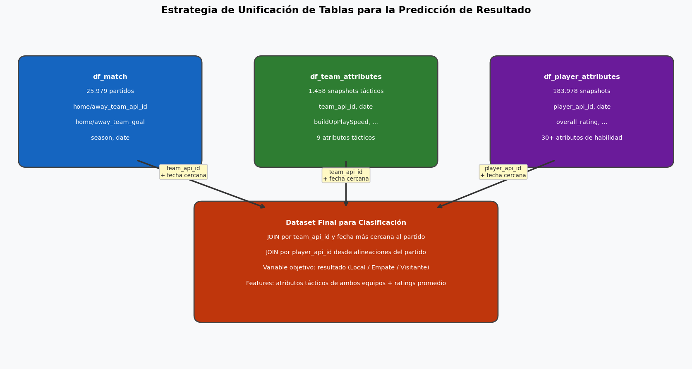

# Minería de Datos — TP Integrador


Análisis y modelado sobre la [European Soccer Database](https://www.kaggle.com/datasets/hugomathien/soccer) (Kaggle, de la serie FIFA de EA Sports): predicción de resultados de fútbol europeo y caracterización de perfiles de jugadores y equipos a partir de atributos técnicos, tácticos y físicos. El detalle metodológico y la interpretación de los resultados se documentan en `informe/TPIG2.md`.

## Objetivos

1. **Clustering**: identificar arquetipos de jugadores y estilos tácticos de equipos mediante K-Medias.
2. **Clasificación**: predecir el resultado de un partido (victoria local, empate, victoria visitante) con XGBoost, cuotas de apuesta, rachas recientes y TabNet.
3. **Regresión**: estimar la valoración general (`overall_rating`) de un jugador a partir de su perfil físico y su posición.

## Resultados

Todos los valores provienen de la ejecución real del código sobre `data/database.sqlite` (ver [Reproducción](#reproducción)).

### Clustering de equipos (§4.2 del informe)

| Ítem | Valor |
|---|---|
| Registros tácticos | 489 snapshots de `Team_Attributes` |
| Parámetro K | 3 (DB K2=2.51 … K6=2.10; DB@K3≈2.26) |
| Tamaños | Conservador 137 · Contraataque 186 · Ofensivo 166 |
| Representativos | Club Brugge KV / Sporting Charleroi / Real Sociedad |

### Clustering de jugadores (§4.3 del informe)

| Ítem | Valor |
|---|---|
| Elegibles | 166.432 snapshots (sin arqueros, 24 atributos) |
| Muestra | 20.000 registros (`random_state=42`) |
| Parámetro K | 3 (DB@K3 ≈ 1.56) |
| Tamaños | Delantero 7.831 · Mediocampista 6.526 · Defensor 5.643 |
| Representativos | Stefan Nijland / Daniele Dessena / Ryan McGivern |

El algoritmo reproduce, sin información de posición, las tres posiciones fundamentales del fútbol de campo.

### Clasificación — XGBoost (§5.2)

Accuracy de entrenamiento y test sobre 25.979 partidos con 5 recetas de features (breakeven de rentabilidad ≈ 54.05 %):

| Receta | Entrenamiento | Test |
|---|---|---|
| Team Attributes | 52.95 % | 50.54 % |
| Player Attributes | 60.86 % | 52.00 % |
| Player + Team | 60.87 % | 51.92 % |
| Betting Odds (B365) | 52.59 % | 52.19 % |
| Combinado (PA + TA + cuotas + racha) | 59.77 % | **52.42 %** |

Ningún modelo alcanza el umbral de rentabilidad. Las cuotas de apuesta, por sí solas, igualan al mejor modelo de atributos, consistente con la sección de cuotas del informe (§5.1). En el Combinado, la cuota local (B365H) es la variable más importante del árbol y del ensamble.

### Mitigación del sobreajuste (§5.3) y TabNet (§5.4)

| Modelo | Entrenamiento | Test | Brecha |
|---|---|---|---|
| Original (Combinado) | 60.52 % | 52.48 % | 8.04 pp |
| Regularizado + early stopping | 56.89 % | 52.41 % | 4.48 pp |
| Optuna (50 trials, mlogloss valid 0.966) | 66.62 % | 51.54 % | 15.08 pp |
| TabNet (best_epoch 79) | — | 50.99 % | — |

La regularización redujo la brecha train-test sin sacrificar exactitud de test; la búsqueda de hiperparámetros no mejoró el rendimiento en test, lo que sugiere un techo informativo del dataset cercano al 52 %.

### Regresión de atributos de jugador (objetivo 3, §5.5 del informe)

10.621 jugadores; entrada solo perfil físico (edad, altura, peso) y posición derivada del clustering:

| Modelo | MAE | RMSE | R² |
|---|---|---|---|
| Baseline | 5.034 | 6.264 | -0.004 |
| Ridge | 4.558 | 5.656 | 0.182 |
| Random Forest | 4.537 | 5.629 | 0.189 |
| XGBoost | **4.417** | **5.454** | **0.239** |

El físico y la posición explican cerca de un cuarto de la variabilidad de la valoración; el resto depende de habilidades técnicas no incluidas como entrada.

## Visualizaciones

Las figuras se encuentran en `graficos/` y se regeneran con `scripts/gen_graficos.py`.



*Partidos por liga y distribución por temporada (§4.1).*



*Equipos únicos por liga y win rate local (§4.1).*



*Selección de K: DB Score y curva del codo (§4.2–§4.3).*



*Estilos tácticos de equipos — K-Medias K=3 (§4.2).*



*Perfiles de habilidad por cluster — K-Medias K=3 (§4.3).*



*Boxplot de B365H por resultado — mediana 1.85 en victorias locales (§5.1).*


*Accuracy por receta de features con umbral de rentabilidad (breakeven) (§5.2).*



*Estrategia de unificación de tablas para el conjunto Combinado (§5.2).*


*Mitigación del sobreajuste: train vs test por modelo (§5.3).*


*Regresión de overall_rating: MAE, RMSE y R² por modelo (§5.5).*

## Estructura

```
├── data/                  database.sqlite (descargar manualmente, no versionado)
├── graficos/              Figuras para el README y el portfolio (PNG)
├── informe/               Informe final (TPIG2.md)
├── models/                Modelos serializados (*.joblib, no versionados)
├── notebooks/
│   ├── 01_eda/            Análisis exploratorio y cuotas de apuesta
│   ├── 02_clustering/     Clustering de equipos y jugadores (§4.2 / §4.3)
│   ├── 03_classification/ XGBoost, cuotas, rachas, regularización y TabNet (§5.2–§5.4)
│   └── 04_regression/     Regresión de atributos — objetivo 3 (§5.5)
├── scripts/               Validación por terminal (experiments.py, generación de notebooks)
└── src/mineria/           Código reutilizable (rutas, carga, features, modelos, clustering, plots)
```

## Setup

```bash
python -m venv .venv
.venv\Scripts\activate          # Windows
pip install -r requirements.txt
pip install -e .               # instala el paquete src/mineria/
```

Descargar `database.sqlite` desde Kaggle (European Soccer Database) y ubicarlo en:

```
data/database.sqlite
```

> El archivo queda fuera de git (`.gitignore`). Sin él los notebooks no se pueden ejecutar.

Para los notebooks:

```
jupyter notebook notebooks/
```

## Reproducción

Los notebooks canónicos ya vienen ejecutados con sus salidas. Para regenerarlos desde cero:

```bash
# 1. Pipeline de clasificación (5 recetas)
.venv/Scripts/python.exe scripts/experiments.py

# 2. Notebooks canónicos (re-ejecución in-place con salidas frescas)
for nb in notebooks/02_clustering/01_kmeans_equipos.ipynb \
          notebooks/02_clustering/02_kmeans_jugadores.ipynb \
          notebooks/03_classification/00_reporte_xgboost.ipynb \
          notebooks/03_classification/01_mitigacion_tabnet.ipynb; do
  .venv/Scripts/python.exe -m nbconvert --execute --to notebook --inplace "$nb"
done

.venv/Scripts/python.exe -m nbconvert --execute --to notebook --inplace notebooks/03_classification/Pred-Racha.ipynb
.venv/Scripts/python.exe scripts/gen_regression_nb.py
.venv/Scripts/python.exe -m nbconvert --execute --to notebook --inplace notebooks/04_regression/01_regresion_atributos.ipynb

# 3. Figuras del README (graficos/*.png)
.venv/Scripts/python.exe scripts/gen_graficos.py
```

Notas de ejecución:

- `experiments.py` y los notebooks canónicos resuelven las rutas de datos/modelos a través de `src/mineria/config.py` (independiente del directorio actual).
- `Pred-Racha.ipynb` usa rutas relativas (`../../data/...`) y debe ejecutarse desde su propio directorio (`notebooks/03_classification/`), o directamente en Jupyter.
- `Pred-Racha.ipynb` entrena su propio modelo y lo guarda en `models/modelo_pred_racha_analisis.joblib` (sin tocar el artefacto canónico consumido por `src/mineria/inference.py`).

## Dependencias

Entorno `.venv` usado para generar todos los resultados: `python 3.13`, `pandas 3.0.5`, `scikit-learn 1.9.1`, `xgboost 3.4.1`, `optuna 5.0.0`, `pytorch-tabnet`, `torch 2.14.0+cpu`. Ver `requirements.txt` para la lista completa.
