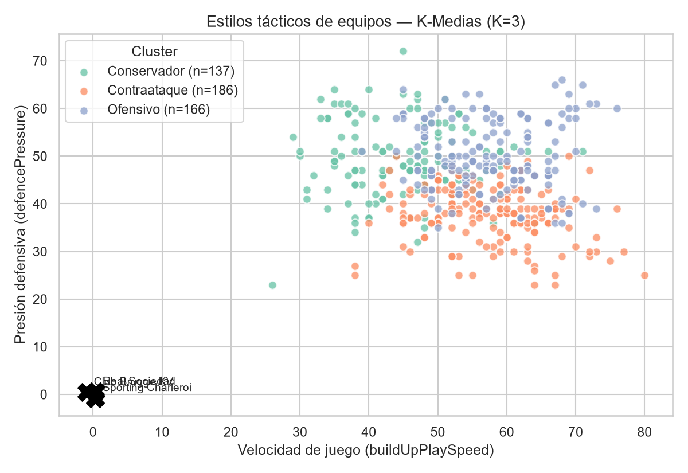
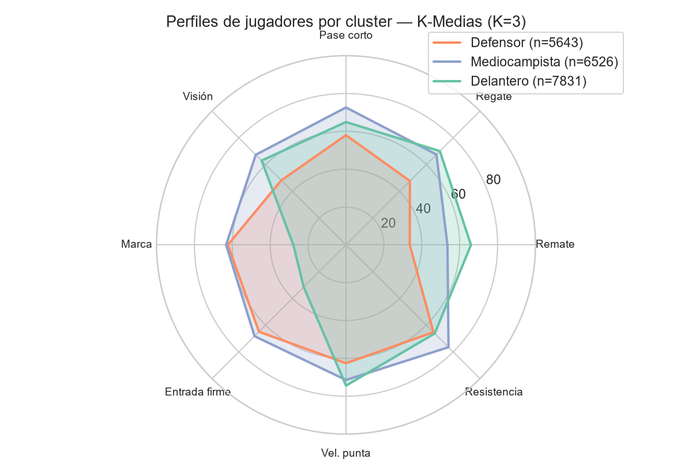
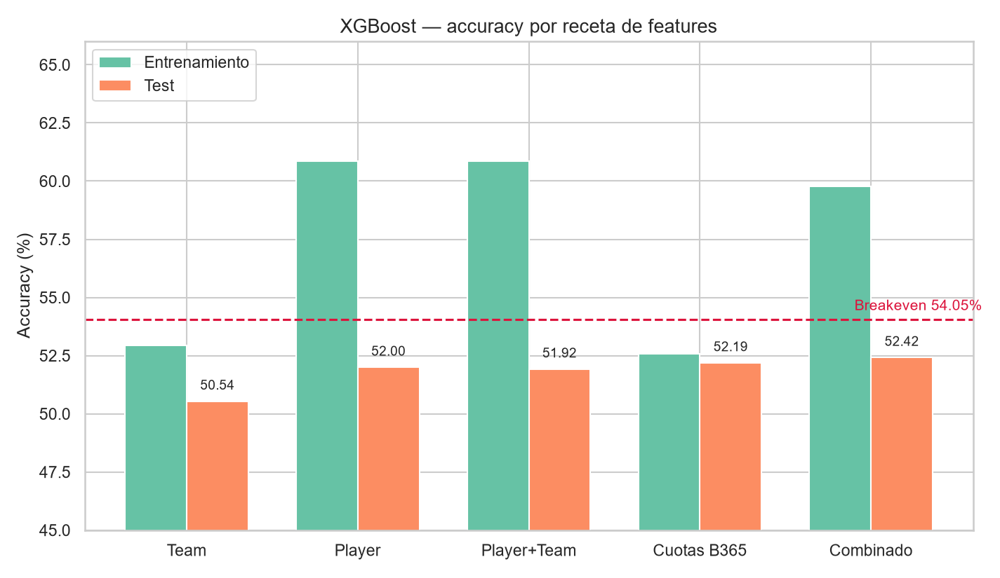
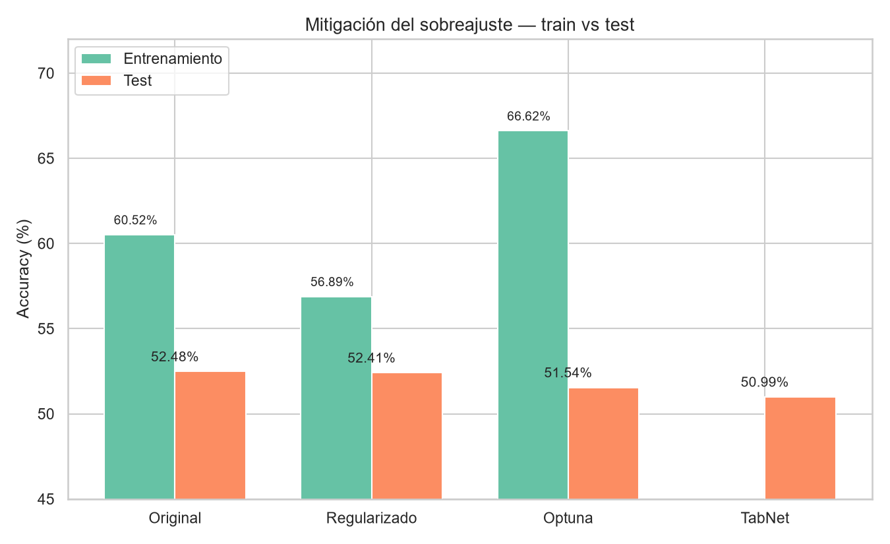
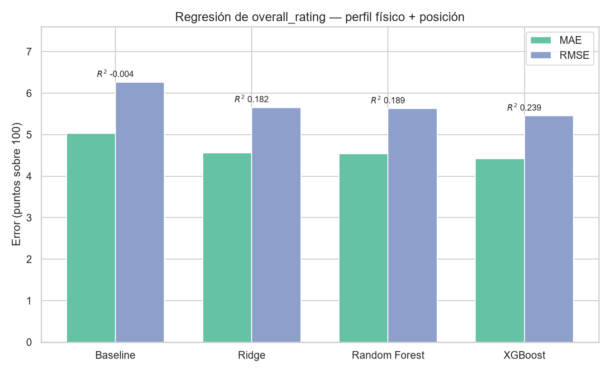

# TP Integrador

**Ejercicio Entregable, TP Integrador**

- **Autores:** Iacobucci, Juan Bautista — Prieto, Alán Daniel — Terechovich, Agustin
- **Institución:** UNLP, Informática
- **Dataset:** [European Soccer Database](https://www.kaggle.com/datasets/hugomathien/soccer) (Kaggle)

---

## 1. Introducción

El presente trabajo se enmarca en la aplicación de técnicas de análisis de datos al ámbito deportivo. En particular, se busca abordar un problema de predicción dentro del fútbol profesional, donde la disponibilidad de datos históricos permite modelar comportamientos complejos asociados al rendimiento de equipos y jugadores.

En este trabajo nos enfocaremos en tres objetivos generales:

1. **Clustering** — Identificar perfiles o arquetipos de jugadores mediante técnicas de clustering, agrupándolos según sus atributos técnicos y físicos.
2. **Clasificación** — Desarrollar un modelo de clasificación que permita predecir el resultado de un partido (victoria local, empate o victoria visitante) a partir de las características de los equipos involucrados.
3. **Regresión** — Construir un modelo de regresión para estimar atributos de rendimiento de un jugador en función de su perfil físico y su posición.

---

## 2. Descripción del Dominio

El fútbol es un deporte de conjunto disputado entre dos equipos de 11 jugadores cada uno, con el objetivo de introducir el balón en el arco rival. Un partido se divide en dos tiempos de 45 minutos, y el equipo que marca más goles al finalizar el tiempo reglamentario gana. En caso de igualdad, el resultado se registra como empate, salvo en instancias eliminatorias donde se recurre a tiempos extra o penales.

Cada equipo dispone de un arquero y diez jugadores de campo, organizados según una formación táctica que distribuye defensores, mediocampistas y delanteros. La elección de la formación y el estilo de juego (ya sea de posesión, contraataque o presión alta) son decisiones del cuerpo técnico que impactan directamente en el rendimiento del equipo.

El fútbol profesional europeo está organizado principalmente en ligas nacionales, donde los clubes compiten durante una temporada completa bajo el formato de todos contra todos. Las ligas más conocidas son la Premier League (Inglaterra), La Liga (España), la Bundesliga (Alemania), la Serie A (Italia) y la Ligue 1 (Francia). A nivel continental, la UEFA organiza la Champions League y la Europa League, aunque estas competencias no forman parte del dataset analizado. Cada liga es regulada por su federación nacional, bajo los lineamientos generales de la FIFA a nivel mundial y la UEFA a nivel europeo.

Un concepto relevante para este trabajo es la valoración de jugadores mediante videojuegos: EA Sports, desarrolladora de la saga FIFA, asigna a cada jugador real un conjunto de atributos numéricos (como velocidad, regate, pase, disparo o defensa) que buscan reflejar su nivel real de juego. Estas valoraciones, actualizadas semanalmente, constituyen una fuente de datos ampliamente utilizada en análisis deportivos por su cobertura y granularidad.

---

## 3. Descripción del Conjunto de Datos

### 3.1. Caracterización Técnica

La base de datos original tiene una estructura relacional compuesta por 7 tablas (DataFrames), las cuales engloban un total de variables que abarcan desde metadatos hasta estadísticas avanzadas de juego. A continuación, se detallan sus atributos principales:

- **Country** (1 atributo) y **League** (2 atributos): contienen el identificador único del país (`country_id` en la tabla League) y los nombres de los países y ligas europeas (`name`).
- **Team** (4 atributos): almacena los datos identificatorios de los equipos (`team_api_id`, `team_fifa_api_id`) junto con el nombre completo (`team_long_name`) y la abreviación (`team_short_name`).
- **Player** (6 atributos): detalla el perfil demográfico y físico de cada jugador. Incluye IDs (`player_api_id`, `player_fifa_api_id`), nombre (`player_name`), fecha de nacimiento (`birthday`), altura en cm (`height`) y peso en libras (`weight`).
- **Team_Attributes** (24 atributos): contiene evaluaciones tácticas de los equipos en fechas específicas (`date`). Se compone de variables numéricas y clases categóricas sobre la velocidad de construcción de juego (`buildUpPlaySpeed`), pases, creación de oportunidades mediante cruces o tiros (`chanceCreationShooting`), y parámetros defensivos como presión y agresividad (`defencePressure`, `defenceAggression`).
- **Player_Attributes** (41 atributos): es el núcleo del rendimiento técnico individual extraído del videojuego FIFA. Además de las fechas y claves (`player_api_id`, `player_fifa_api_id`), abarca métricas numéricas (escala 0–100) como valoración general (`overall_rating`), potencial (`potential`), ritmo (`sprint_speed`), precisión (`finishing`, `short_passing`), físico (`stamina`, `strength`) y reflejos de portero (`gk_diving`). Incluye atributos categóricos como la pierna hábil (`preferred_foot`) y la tasa de trabajo ofensivo/defensivo (`attacking_work_rate`).
- **Match** (114 atributos): es la tabla más densa con casi 26.000 encuentros. Agrupa sus columnas de la siguiente manera:
  - **Metadatos e IDs** (6 columnas): temporada, fecha, identificadores de liga y de los equipos locales y visitantes (ej. `match_api_id`).
  - **Resultados** (2 columnas): goles del equipo local (`home_team_goal`) y visitante (`away_team_goal`).
  - **Alineaciones y Coordenadas** (44 columnas): identificadores de los 11 jugadores de cada equipo (`home_player_1` a `home_player_11`), así como sus posiciones X e Y en el campo de juego.
  - **Eventos del partido** (8 columnas): formato de texto/XML con el desglose de posesión, goles, tiros, faltas y tarjetas (`goal`, `card`, `possession`, etc.).
  - **Cuotas de apuestas** (30 columnas): probabilidades de victoria local (H), empate (D) y visitante (A) de múltiples casas de apuestas como Bet365 (`B365H`), Bwin (`BWH`) y Pinnacle (`PSH`).

La descripción de atributos detallada, los tipos de datos y los ejemplos de las 7 tablas pueden consultarse en el [Anexo](#anexo-diccionario-de-datos) al final del documento.

### 3.2. Metodología de Recolección

El conjunto de datos utilizado, denominado "European Soccer Database", es una base de datos de acceso público obtenida a través de la plataforma Kaggle. Este repositorio fue construido mediante la integración de información proveniente de múltiples fuentes dispersas en la web, requiriendo un exhaustivo proceso de recopilación y procesamiento (crawling/scraping) mediante scripts automatizados en Python.

El origen de los datos se segmenta principalmente en tres fuentes distintas:

1. **Eventos y Alineaciones**: los resultados, formaciones de los equipos y eventos detallados del partido (goles, posesión, tarjetas, etc.) fueron extraídos de la API y el portal web de estadísticas deportivas *football-data.mx-api.enetscores.com*.
2. **Cuotas de Apuestas**: la información sobre las probabilidades (betting odds) proporcionadas por hasta 10 casas de apuestas diferentes fue recopilada del portal *football-data.co.uk*.
3. **Atributos de Jugadores y Equipos**: las métricas físicas, técnicas y tácticas fueron obtenidas mediante técnicas de scraping aplicadas sobre el sitio *sofifa.com*, el cual actúa como un repositorio de las estadísticas oficiales utilizadas en la saga de videojuegos "FIFA" de la empresa EA Sports.

**Sesgos potenciales y problemas de recolección**

El análisis del proceso de recolección revela ciertas limitaciones y sesgos inherentes a la forma en que los datos fueron construidos:

- **Sesgo de subjetividad en atributos técnicos**: al depender de las bases de datos del videojuego FIFA (EA Sports), las habilidades de los jugadores y las métricas tácticas de los equipos no son mediciones empíricas estrictas, sino evaluaciones subjetivas realizadas por "scouts" y desarrolladores del juego. Aunque son ampliamente aceptadas como aproximaciones válidas en el dominio deportivo, introducen un sesgo humano en las variables predictivas.
- **Pérdida de datos por sincronización**: el autor del dataset señala explícitamente problemas en la integración de las fuentes. Existen jugadores ausentes en las alineaciones (valores `NULL`) debido a fallos del algoritmo de "crawling" al intentar emparejar los registros de los partidos reales con la base de datos de *sofifa.com*.

### 3.3. Análisis Inicial

Un análisis preliminar sobre el conjunto de datos revela una distribución dispar en los valores faltantes. Por un lado, las tablas como Country, League y Player poseen el 100% de sus registros completos. Otras, como Team o las estadísticas numéricas de Player Attributes, presentan vacíos muy reducidos (aproximadamente 800 faltantes sobre un total de 183.978 registros).

Sin embargo, se detectó una pérdida de información sistemática en la tabla Match:

- **Eventos del partido**: todos los atributos correspondientes a los eventos del partido (tales como `goal`, `shoton`, `card` y `possession`) presentan exactamente **11.762 valores nulos**.
- **Cuotas de apuestas**: fluctúan severamente dependiendo de la cobertura de cada proveedor (por ejemplo, la casa de apuestas Pinnacle carece de más del 50% de sus datos históricos).

Para un primer análisis sobre el conjunto de datos, se inspeccionaron los posibles valores atípicos mediante diagramas de caja (Boxplots) y estadísticos descriptivos.

El estudio de valores atípicos en `df_player_attributes` exige una segmentación previa de la población para una correcta interpretación de las distribuciones. Esto obedece a que las habilidades de portería (`gk_diving`, `gk_handling`, `gk_kicking`, `gk_positioning`, `gk_reflexes`) y las de campo son excluyentes por la lógica del videojuego. Bajo esta premisa, se categorizaron **13.394 arqueros** (con `gk_diving ≥ 60`) y **167.871 jugadores de campo**, graficando sus comportamientos de manera independiente.

- **Jugadores de campo**: se verifica que las variables numéricas oscilan en el espectro previsto (0–100) sin errores de carga. Las anomalías estadísticas en los límites superiores de valoración (`overall_rating`, `sprint_speed`, `finishing`) evidencian a la élite del fútbol mundial, mientras que los valores bajos en métricas de arquero son inherentes a su rol. Dado que son registros válidos en el dominio deportivo, se conservan para el análisis.
- **Arqueros**: se observa una inversión simétrica del patrón. Los atributos específicos de portería muestran medianas elevadas (60–70) con baja variabilidad, contrastando con sus métricas de ataque y defensa (`finishing`, `dribbling`, `marking`), las cuales se sitúan en niveles mínimos. Este fenómeno ratifica que este grupo es evaluado mediante un perfil de aptitudes estructuralmente diferenciado.

Esta diferenciación demuestra que los supuestos valores atípicos detectados inicialmente no constituían ruido estadístico, sino el efecto de agrupar poblaciones con escalas incompatibles. Para garantizar la consistencia de los modelos de clustering y clasificación, se ha determinado **omitir a los porteros** del conjunto de entrenamiento, aplicando un filtro de exclusión (`gk_diving < 30`).

Se hizo un trabajo de preprocesamiento sobre la tabla de Match, que cuenta con un total de **25.979 registros**. Para las diferentes técnicas de análisis, se decidió eliminar todas las columnas con registros nulos, o las columnas que no fueran relevantes para el análisis de esa estrategia, para luego volver a eliminar las columnas incompletas.

Si bien se generó una visualización de la cantidad de ausencias, su extensión (superior a las 115 columnas) dificulta la representación gráfica legible dentro de este informe de todos los datos eliminados. Por ello, se describen a continuación cada uno de estos atributos:

- **Variables de alineación**: los identificadores de jugadores (ej. `home_player_1` a `home_player_11`) presentan una ausencia de entre 1.224 y 2.532 registros (aprox. 5%–10%). Esto indica partidos donde la hoja de alineación no fue digitalizada correctamente.
- **Variables de mercado (apuestas)**: mientras que operadores líderes como Bet365 (`B365H`) tienen 3.387 nulos (13%), otros operadores como Gamebookers (`GBH`) o Stan James (`SJH`) alcanzan cifras alarmantes de 11.817 (45,4%) y 13.130 (50,5%) nulos respectivamente.

La predominancia de nulos en estos atributos responde a tres factores fundamentales:

1. **Contexto temporal (2008–2016)**: en las temporadas iniciales (2008–2010), la recolección de metadatos no era tan exhaustiva. Por ejemplo, la cobertura de cuotas de apuestas es mucho más fragmentada en los primeros 3 años del dataset.
2. **Disponibilidad de operadores**: muchas casas de apuestas incluidas en el dataset, como SJH o GB, no operaban en todas las ligas europeas o, en algunos casos, cesaron actividades o fueron absorbidas antes de finalizar el periodo de toma de datos en 2016.
3. **Sesgo de ligas**: existe una disparidad notable entre las ligas "Top 5" de Europa y ligas menores (ej. Polonia o Bélgica), donde las agencias de apuestas suelen tener una cobertura limitada.

Una presencia de casi el 50% de nulos en variables de apuestas impide el uso de técnicas de imputación simples (como la media), ya que se introduciría un sesgo artificial masivo. Por consiguiente, se ha determinado **descartar las columnas con más del 30% de nulos** y priorizar el uso de variables con mayor integridad como B365 para el entrenamiento del modelo de clasificación de resultados.

---

## 4. Análisis Exploratorio

### 4.1 Estructura Geográfica y de Ligas

El dataset abarca **11 ligas europeas de 11 países distintos**, con un total de **25.979 partidos** disputados a lo largo de **8 temporadas (2008/09 – 2015/16)** y **299 equipos únicos**.

Como se observa en la Figura 4.1, la distribución de partidos no es uniforme entre ligas. Las cuatro grandes ligas (Premier League, Ligue 1, La Liga y Serie A) concentran el mayor volumen con aproximadamente 3.040 partidos cada una, mientras que la Swiss Super League es la liga con menor representación (1.422 partidos). Esto responde a que las ligas más pequeñas tienen menos equipos participantes. La distribución por temporada es relativamente estable, con una leve caída en la temporada 2015/16, posiblemente por datos aún incompletos al momento de la recolección.

La Figura 4.2 presenta dos perspectivas complementarias. A la izquierda, la cantidad de equipos únicos por liga varía entre **16 (Bundesliga)** y **26 (Serie A)**, lo cual explica directamente las diferencias en el volumen de partidos observadas en la Figura 4.1. A la derecha, se analiza el win rate local por liga: en todas las competencias el equipo local gana con mayor frecuencia que el visitante, confirmando la ventaja de localía a nivel global (**45.87% de victorias locales** en el dataset). La liga española muestra el valor más alto (48.8%), mientras que la Premier League escocesa exhibe el más bajo (41.7%), sugiriendo diferencias de competitividad entre ligas que el modelo de clasificación deberá considerar.

### 4.2 Agrupamiento de Equipos por Estilo Táctico (K-Medias)

Con el objetivo de comprender los distintos perfiles de juego de los equipos, se aplicó el algoritmo **K-Medias** sobre los 9 atributos numéricos de `df_team_attributes`, que incluyen parámetros de construcción de juego (velocidad, pase, regate), creación de oportunidades (pases, cruces, disparos) y comportamiento defensivo (presión, agresividad, amplitud). Los registros con valores nulos fueron excluidos, resultando en **489 snapshots tácticos**.

Previo a la ejecución del algoritmo, los atributos fueron estandarizados mediante **z-score** para evitar que las diferencias de escala distorsionen el cálculo de distancias.

Los nombres utilizados para los atributos en esta sección corresponden a los siguientes dentro del dataset:

| Término usado en el informe | Atributo en el dataset |
|---|---|
| Velocidad de juego | `buildUpPlaySpeed` |
| Regate (en construcción) | `buildUpPlayDribbling` |
| Pase (en construcción) | `buildUpPlayPassing` |
| Creación de pase | `chanceCreationPassing` |
| Creación de cruce | `chanceCreationCrossing` |
| Creación de disparo | `chanceCreationShooting` |
| Presión defensiva | `defencePressure` |
| Agresividad defensiva | `defenceAggression` |
| Amplitud defensiva | `defenceTeamWidth` |

**Selección del parámetro K.** Como se muestra en la Figura 4.3 (fila superior), se evaluaron valores de K entre 2 y 6 utilizando dos criterios complementarios: el índice Davies-Bouldin (DB) (donde menores valores indican clusters más compactos y separados) y la curva del codo (inercia intra-cluster). El DB Score mejora progresivamente desde **K=2 (2.51)** hasta **K=6 (2.10)**, sin un punto de quiebre pronunciado. No obstante, la curva del codo muestra una reducción de inercia marcada entre K=2 y K=3, con una inflexión clara en ese punto. Combinando ambos criterios y priorizando la interpretabilidad semántica de los grupos en el contexto del dominio futbolístico, se seleccionó **K=3** como configuración óptima.

**Perfiles identificados.** La Figura 4.4 presenta los tres grupos obtenidos mediante gráficos de radar y una comparación de atributos clave:

- **Grupo 1 — Conservador (n=137)**: equipos de juego lento (velocidad de juego, `buildUpPlaySpeed`: 45.1) con pases cortos y conservadores (pase, `buildUpPlayPassing`: 41.3). Su presión defensiva (`defencePressure`) es moderada (49.0). Este perfil corresponde a equipos que priorizan no perder la pelota antes que generar situaciones de peligro.
- **Grupo 2 — Contraataque (n=186, el más numeroso)**: equipos con velocidad de juego (`buildUpPlaySpeed`) media-alta (57.5) pero presión defensiva (`defencePressure`) notablemente baja (38.1) y agresividad defensiva (`defenceAggression`) reducida (43.6). Este perfil refleja un estilo de bloque bajo con transiciones rápidas.
- **Grupo 3 — Ofensivo (n=166)**: equipos con los valores más altos en creación de disparo (`chanceCreationShooting`: 56.8), alta velocidad de juego (`buildUpPlaySpeed`: 57.7) y presión defensiva (`defencePressure`) activa (50.1). Corresponde a equipos que imponen su juego en ambas fases.

Esta clasificación tiene relevancia directa para el modelo de predicción: un enfrentamiento entre un equipo Conservador y uno Ofensivo tiene características estructuralmente distintas a un duelo entre dos equipos de Contraataque.

Con el fin de validar la consistencia interna de los perfiles identificados, se procedió a localizar aquellos clubes cuyas métricas tácticas presentan la menor distancia euclidiana respecto a cada centroide, actuando como los exponentes más fieles de cada categoría.

- **Grupo 1 — Conservador**: las entidades más próximas al centroide (`buildUpPlaySpeed`: 45.1; `buildUpPlayPassing`: 41.3; `defencePressure`: 49.0) son el **Club Brugge KV** y el **Partick Thistle F.C.** Se observa que estos equipos, pertenecientes a ligas con menor volumen de datos en el dataset, mantienen una identidad histórica de bajo riesgo y construcción pausada, lo que ratifica la coherencia semántica del agrupamiento.
- **Grupo 2 — Contraataque**: destacan como referentes el **Sporting Charleroi** y el **AS Saint-Étienne** (`buildUpPlaySpeed`: 58; `defencePressure`: 35). El conjunto francés es un ejemplo paradigmático de transiciones rápidas partiendo de un bloque bajo. Asimismo, la inclusión del **Newcastle United** de las temporadas 2014–2016 refuerza este perfil, dada su tendencia reactiva y defensiva durante dicho periodo bajo sus respectivas conducciones técnicas.
- **Grupo 3 — Ofensivo**: los exponentes de este clúster son la **Real Sociedad** y el **Hércules Club de Fútbol** (`chanceCreationShooting`: 60). El caso del equipo donostiarra en 2015 es ilustrativo, ya que su modelo de juego se basaba en la tenencia del balón y una presión alta sobre la salida rival, parámetros que definen la naturaleza propositiva de este tercer grupo.

### 4.3 Agrupamiento de Jugadores por Perfil de Habilidad (K-Medias)

De manera complementaria, se aplicó K-Medias sobre `df_player_attributes` para identificar arquetipos de jugadores (**Objetivo 1** del trabajo). Se excluyeron los registros correspondientes a arqueros (identificados por `gk_diving ≥ 30`), trabajando con 24 atributos de rendimiento de campo. Dado el volumen total de **166.432 registros elegibles**, se utilizó una muestra aleatoria representativa de **20.000 registros** (`random_state=42`) para reducir el costo computacional, con previa estandarización z-score.

Los nombres utilizados en esta sección corresponden a los siguientes atributos en el dataset:

| Término usado en el informe | Atributo en el dataset |
|---|---|
| Remate | `finishing` |
| Pase corto | `short_passing` |
| Regate | `dribbling` |
| Marca | `marking` |
| Entrada firme | `standing_tackle` |
| Resistencia | `stamina` |
| Velocidad punta | `sprint_speed` |
| Cabeceo | `heading_accuracy` |
| Rating general | `overall_rating` |

**Selección del parámetro K.** La Figura 4.3 (fila inferior) muestra que el DB Score es **mínimo para K=3 (1.56)**, con un deterioro claro a partir de K=4. La curva del codo confirma que la reducción de inercia más pronunciada ocurre entre K=2 y K=3. Se seleccionó **K=3**.

**Perfiles identificados.** La Figura 4.5 presenta el perfil de habilidades de cada grupo:

- **Defensor (n=5.643, 28.2%)**: valores bajos en remate (`finishing`: 33.7) y regate (`dribbling`: 47.7), pero altos en marca (`marking`: 62.3) y entrada firme (`standing_tackle`: 64.9). Su velocidad punta (`sprint_speed`) y resistencia (`stamina`) son moderadas. Este grupo agrupa a los jugadores cuya función principal es neutralizar al rival.
- **Mediocampista (n=6.526, 32.6%)**: perfil más equilibrado. Presenta el mayor pase corto (`short_passing`) del dataset (72.6) y valores intermedios tanto en ataque como en defensa (marca, `marking`: 63.3; entrada firme, `standing_tackle`: 68.3; remate, `finishing`: 53.5). Son los jugadores bisagra entre fases.
- **Delantero (n=7.831, 39.2%)**: el grupo más numeroso. Destaca con el mayor remate (`finishing`: 66.0), regate (`dribbling`: 70.1) y visión de juego (`vision`: 63.0), pero con marca (`marking`: 27.8) y entrada firme (`standing_tackle`: 31.6) muy bajos. Estos jugadores están optimizados para la creación y conversión de goles.

Es notable que el algoritmo, sin recibir información sobre las posiciones de los jugadores, logró reproducir con notable precisión las tres posiciones fundamentales del fútbol de campo.

Con el propósito de validar la consistencia de los arquetipos generados, se procedió a localizar aquellos futbolistas de la muestra cuya distancia euclidiana respecto a los centroides de cada clúster es mínima, actuando como referentes empíricos de cada categoría.

- **Grupo Mediocampista**: las entidades más próximas al centroide (`finishing`: 53.5; `short_passing`: 72.6; `marking`: 63.3) son **Daniele Dessena, Marco Caligiuri y Nico Pulzetti**. Se observa que estos jugadores mantienen una identidad de mediocampistas integrales con una equilibrada capacidad de distribución y recuperación, lo cual ratifica la coherencia semántica del perfil bisagra esperado.
- **Grupo Defensor**: destacan como exponentes **Ryan McGivern, Karel van Roose y Oliver Vinamont** (`marking`: 62.3; `standing_tackle`: 64.9). Ambos perfiles corresponden a especialistas defensivos con una participación ofensiva marginal en términos de remate, validando que el algoritmo logra aislar correctamente las funciones de neutralización del rival.
- **Grupo Delantero**: los referentes de este clúster (`finishing`: 66.0; `marking`: 27.8) son **Stefan Nijland, Pablo Chavarria y Aleksandar Trajkovski**. El desempeño de estos atacantes se caracteriza por una alta eficacia en la finalización y una nula implicación en tareas de marca, parámetros que definen la naturaleza resolutiva de este tercer agrupamiento.

En las tres categorías analizadas, la correspondencia entre los futbolistas reales y las descripciones teóricas de los centroides demuestra que el modelo captura patrones tácticos consistentes con el dominio deportivo. Este hallazgo sugiere que la configuración de K=3 posee una solidez interpretativa que trasciende los estadísticos de validación técnica, reflejando fielmente la estructura del fútbol profesional.

---

## 5. Modelos Predictivos

### 5.1 Predicción por Cuota de Apuesta

Tal como se mencionó en la Sección 4.4, las cuotas de apuesta de Bet365 (B365H, B365D, B365A) se incorporarán como variable auxiliar de referencia en el dataset de clasificación. Antes de utilizarlas, se analizó su relación con la variable objetivo resultado para validar su capacidad predictiva.

Al clasificar los resultados en Victoria Local, Empate y Victoria Visitante, observamos un sesgo marcado hacia la localía.

Para afinar la selección de atributos, se analizó el comportamiento de las cuotas. Al observar el diagrama de caja (boxplot) de la cuota B365H, se evidencia que en los partidos que finalizaron en victoria local, el valor de la mediana de estas cuotas es significativamente más bajo (**1.85**) en comparación con las medianas observadas en los empates o derrotas.

Este patrón de "cuota baja = alta probabilidad" es consistente en todas las casas de apuestas analizadas. Para verificar esta consistencia, se comparó el comportamiento de B365H con el de las 3 casas de apuestas con menor proporción de datos faltantes (BWH, WHH y VCH). Dado que B365H es la que presenta mayor cobertura de datos entre todas las disponibles, se mantiene como la variable principal de cuotas para el análisis posterior. Esta comparación confirma que las cuotas son predictores robustos y uniformes entre proveedores.

El uso de cuotas como variable de entrada permite capturar una "inteligencia colectiva" que eleva la tasa de acierto. Al segmentar los partidos por rangos de cuotas, se observa que a menor cuota asignada al local, el Win Rate efectivo aumenta. Utilizar la cuota mínima como criterio de decisión es fundamental para el éxito del modelo. El mismo se mide por su capacidad de alcanzar el umbral de rentabilidad del **54.05%**. Este valor representa el punto de equilibrio (breakeven) matemático para una cuota estándar de 1.85, calculado mediante la probabilidad implícita (1 / 1.85). Superar este porcentaje de acierto es el objetivo final de este trabajo, ya que implica que el algoritmo no solo predice mejor que el azar, sino que es capaz de neutralizar la comisión de la casa de apuestas y generar una ganancia neta.

> **Nota.** La probabilidad implícita es la conversión de la cuota de una casa de apuestas en un porcentaje que representa la probabilidad de que ocurra un evento según el mercado. Se calcula con la fórmula `1 / Cuota`. Este valor define el punto de equilibrio (breakeven): para obtener ganancias netas, un algoritmo debe lograr una tasa de acierto superior a esta probabilidad.

### 5.2 Árboles de Decisión, Machine Learning y XG Boost

En esta etapa se decidió hacer un armado de distintos modelos de predicción. De forma secuencial se fueron agregando características al modelo, buscando así una mejor predicción en cada iteración. Para realizar una comparativa entre la utilidad del cambio de características, se decide mantener el uso de un solo modelo de predicción, **XG Boost**.

Se creó un dataframe a partir de la tabla de partidos. En esta nueva tabla se codifican los resultados en Home Win (Ganador Local), Draw (Empate) y Away Win (Ganador Visitante). Para el entrenamiento se tomaron medidas de limpieza en cada dataframe:

- Se eliminaron columnas de identificación (id).
- Se hizo una codificación numérica de los atributos (One Hot encoding).
- Se eliminaron características no numéricas irrelevantes al análisis (como los eventos del partido).
- Se reemplazaron los datos faltantes con la media de los atributos de su categoría.

#### Conjunto de Datos: Team Attributes

Se tomaron los últimos atributos disponibles de cada equipo. Específicamente tomamos la última versión disponible en la base de datos; se asume que los desarrolladores del FIFA han decidido que es la más representativa del equipo respecto a sus habilidades.

| Categoría | Atributos |
|---|---|
| Atributos utilizados (numéricos) | `buildUpPlaySpeed`, `buildUpPlayDribbling`, `buildUpPlayPassing`, `chanceCreationPassing`, `chanceCreationCrossing`, `chanceCreationShooting`, `defencePressure`, `defenceAggression`, `defenceTeamWidth`, `buildUpPlaySpeedClass`, `buildUpPlayDribblingClass`, `buildUpPlayPassingClass`, `buildUpPlayPositioningClass`, `chanceCreationPassingClass`, `chanceCreationCrossingClass`, `chanceCreationShootingClass`, `chanceCreationPositioningClass`, `defencePressureClass`, `defenceAggressionClass`, `defenceTeamWidthClass`, `defenceDefenderLineClass` |
| Atributos no utilizados | `id`, `team_fifa_api_id`, `team_api_id`, `date` |

#### Conjunto de Datos: Player Attributes

Se tomaron los últimos atributos disponibles de cada jugador, asumiendo que constituyen la representación más actual del nivel de habilidad del jugador.

| Categoría | Atributos |
|---|---|
| Atributos utilizados (float64) | `overall_rating`, `potential`, `crossing`, `finishing`, `heading_accuracy`, `short_passing`, `volleys`, `dribbling`, `curve`, `free_kick_accuracy`, `long_passing`, `ball_control`, `acceleration`, `sprint_speed`, `agility`, `reactions`, `balance`, `shot_power`, `jumping`, `stamina`, `strength`, `long_shots`, `aggression`, `interceptions`, `positioning`, `vision`, `penalties`, `marking`, `standing_tackle`, `sliding_tackle`, `gk_diving`, `gk_handling`, `gk_kicking`, `gk_positioning`, `gk_reflexes` |
| Atributos no utilizados | `id`, `player_fifa_api_id`, `player_api_id`, `date`, `preferred_foot`, `attacking_work_rate`, `defensive_work_rate` |

#### Conjunto de Datos: Betting Odds

En este caso se hace un cambio de estrategia. Se hace un análisis solo con la información de las casas de apuestas. Se dispone de información desde diferentes plataformas, con diferentes porcentajes de valores nulos; se ha trabajado con el top más completo.

| Casa de apuestas | Columnas | Filas con algún nulo (%) |
|---|---|---|
| B365 | [B365H, B365D, B365A] | 13.04 |
| BW | [BWH, BWD, BWA] | 13.10 |
| WH | [WHH, WHD, WHA] | 13.12 |
| VC | [VCH, VCD, VCA] | 13.13 |
| LB | [LBH, LBD, LBA] | 13.18 |
| IW | [IWH, IWD, IWA] | 13.31 |
| SJ | [SJH, SJD, SJA] | 34.19 |
| GB | [GBH, GBD, GBA] | 45.49 |
| BS | [BSH, BSD, BSA] | 45.49 |
| PS | [PSH, PSD, PSA] | 57.01 |

#### Conjunto de Datos: Team, Player Attributes + Betting Odds + Streak

Finalmente, se hace un análisis con todas las características anteriores posibles. Además, se hace una ingeniería sobre los datos presentes: se suma un atributo de "Racha" para el equipo local y visitante, en donde se hace un conteo de los últimos encuentros en una ventana de **5, 10 y 15 partidos**.

#### Análisis Comparativo de Resultados

Entre los resultados de los cuatro modelos entrenados (Team Attributes, Player Attributes, Betting Odds y el conjunto Combinado) se observa un patrón consistente: en todos los casos el modelo predice con mayor precisión y recall la clase Victoria Local (Home Win), mientras que la clase Empate (Draw) resulta sistemáticamente la más difícil de capturar. Este comportamiento es consistente con la naturaleza estadística del empate: a diferencia de una victoria, que suele estar asociada a una diferencia de forma o calidad entre los equipos, un empate puede originarse tanto en partidos parejos como en partidos dominados que no se concretan en gol, lo que dificulta que el algoritmo identifique un patrón discriminante claro. Al optimizar la función de pérdida multiclase (mlogloss), el modelo tiende a sacrificar la clase minoritaria de mayor incertidumbre en favor de las clases con señal más fuerte.

| Receta | Accuracy entrenamiento | Accuracy test |
|---|---|---|
| Team Attributes | 52.95% | 50.54% |
| Player Attributes | 60.86% | 52.00% |
| Player + Team | 60.87% | 51.92% |
| Betting Odds | 52.59% | 52.19% |
| **Combinado** (PA + TA + cuotas + racha) | **59.77%** | **52.42%** |

El conjunto **Combinado** obtiene la mejor exactitud en test (52.42%), apenas por encima de Player Attributes (52.00%), lo que indica que sumar cuotas de apuesta y racha reciente al conjunto de atributos de jugador aporta una mejora marginal, no sustancial. Resulta especialmente relevante que el modelo entrenado únicamente con las tres cuotas de casas de apuestas alcance un **52.19%** de exactitud en test, incluso por encima del modelo de Player Attributes pese a utilizar solo tres variables de entrada frente a varias decenas. Esto refuerza lo planteado en la Sección 5.1: la cuota de apuesta condensa una inteligencia colectiva del mercado que resulta difícil de igualar con atributos técnicos individuales.

**Árbol de decisión individual.** Para interpretar de forma más directa la lógica de decisión del modelo, se entrenó y visualizó un árbol de decisión individual (profundidad máxima 3) sobre el conjunto de datos Combinado:

- La **raíz** del árbol divide los partidos según la racha del equipo local en sus últimos 10 encuentros (`home_streak_10 ≤ 1.613`), con un índice de **Gini de 0.643** sobre los **20.783 registros de entrenamiento**.
- En el **segundo nivel**, ambas ramas vuelven a dividirse según la racha del equipo visitante (`away_streak_10`), confirmando que la forma reciente de ambos equipos es, jerárquicamente, el criterio más determinante antes de considerar cualquier atributo individual de habilidad.
- Recién en el **tercer nivel** aparecen atributos puntuales de jugadores: interceptaciones del cuarto jugador local (`home_player_4_interceptions`), potencial del tercer jugador visitante (`away_player_3_potential`), rating general del quinto jugador local (`home_player_5_overall_rating`) y volea del octavo jugador local (`home_player_8_volleys`), lo que sugiere que estos atributos funcionan como ajustes finos una vez establecido el contexto de forma reciente, y no como predictores primarios.

> **Nota.** Este árbol se entrenó sobre el Combinado sin incorporar cuotas de apuesta: al incluir las cuotas en el conjunto de datos, la raíz pasa a ser la cuota del local (B365H ≤ 2.64) y las rachas y atributos de jugador quedan relegados a niveles inferiores, lo que evidencia que la señal del mercado condensa la información más determinante disponible, en línea con lo discutido en la Sección 5.1.

**Variables más importantes del ensamble completo.** En el ensamble completo del Combinado (que sí incorpora cuotas), las tres variables más importantes son **B365H, B365A y B365D**, seguidas por las rachas recientes (`home_streak_15`) y algunos atributos de jugador. Esta jerarquía confirma lo planteado en la Sección 5.1: la cuota de apuesta condensa una inteligencia colectiva del mercado que resulta difícil de igualar con atributos técnicos individuales, y cuando está disponible domina el árbol individual y el ensamble completo, con una ventaja clara por sobre el perfil estático de habilidades extraído de FIFA.

**Complejidad estructural del modelo Combinado.**

| Métrica | Valor |
|---|---|
| Profundidad máxima configurada | 4 |
| Nodos máximos teóricos por árbol | 31 |
| Nodos reales mínimos por árbol | 17 |
| Nodos reales máximos por árbol | 31 |
| Nodos reales promedio por árbol | 29.26 |
| Nodos de partición promedio por árbol | 14.13 |
| Nodos hoja promedio por árbol | 15.13 |

| Métrica | Valor |
|---|---|
| Número de estimadores | 200 |
| Número de clases | 3 |
| Árboles totales entrenados | 600 |
| Nodos totales del ensamble | 17,556 |
| Nodos hoja totales | 9,078 |
| Nodos de partición totales | 8,478 |

| Hiper Parámetro | Valor |
|---|---|
| objective | `multi:softprob` |
| num_class | 3 |
| eval_metric | `mlogloss` |
| n_estimators | 200 |
| max_depth | 4 |
| learning_rate | 0.05 |
| tree_method | `hist` |
| random_state | 42 |

Aunque el modelo contiene 600 árboles y más de 17.000 nodos en total, cada árbol individual es poco profundo (`max_depth = 4`) y posee en promedio solo 15 nodos hoja. Esta configuración, combinada con una tasa de aprendizaje baja (`learning_rate = 0.05`), distribuye el aprendizaje en numerosas correcciones pequeñas, reduciendo el riesgo de sobreajuste severo. Como resultado, la diferencia entre el rendimiento de entrenamiento y prueba se mantiene moderada **(7.35 puntos)**, pero también limita la capacidad del modelo para capturar relaciones complejas entre los atributos de los jugadores, lo que contribuye a que la exactitud de prueba permanezca cercana al 52%.

**Conclusión respecto al objetivo de rentabilidad.** Los cuatro modelos entrenados superan ampliamente el azar: frente a una probabilidad base de 33% para tres clases, el mejor modelo (Combinado) alcanza **52.42%** de exactitud en test, es decir, más de 19 puntos por encima de adivinar al azar. Esto confirma que las variables seleccionadas (las cuotas de apuesta y la racha reciente de ambos equipos) capturan una señal real y consistente sobre el resultado de un partido, validada tanto por el árbol de decisión individual como por el ensamble completo de XG Boost.

En ese sentido, el resultado más valioso de este trabajo no es tanto la exactitud final, sino la jerarquía de variables que el modelo permitió identificar: la cuota de apuesta —que condensa la forma reciente y la calidad percibida de ambos equipos— y las rachas recientes (`home_streak_10`, `away_streak_10`) resultan más informativas que el perfil estático de habilidades técnicas, un hallazgo que tiene sentido futbolístico y que podría ser el punto de partida para futuras iteraciones del proyecto, por ejemplo incorporando variables de racha con distintas ventanas temporales, o atributos agregados a nivel de plantilla.

### 5.3 Mitigación del Sobreajuste, Búsqueda de Hiper Parámetros

Atendiendo al sobreajuste presentado por el modelo Combinado de la Sección 5.2, se realizaron tres intervenciones adicionales sobre el mismo conjunto de datos: (i) incorporación de **regularización explícita** y un criterio de detención temprana más estricto, (ii) búsqueda automática de hiper parámetros mediante **Optuna**, y (iii) evaluación de una red neuronal (**TabNet**) como alternativa a los árboles de decisión.

#### Regularización y Early Stopping

A diferencia del modelo original, que no incorporaba una fase de validación explícita durante el entrenamiento, se separó un **12.5%** del conjunto de entrenamiento como conjunto de validación (`eval_set`) y se fijó `early_stopping_rounds=10`, deteniendo el ajuste si la métrica de validación (mlogloss) no mejora en 10 rondas consecutivas. Adicionalmente, se incorporaron los siguientes hiper parámetros de penalización, que limitan la magnitud de los pesos aprendidos por cada hoja y desalientan particiones que no aportan una ganancia sustancial:

| Hiper Parámetro | Valor | Función |
|---|---|---|
| `reg_lambda` | 5.0 | Penalización L2 sobre los pesos de las hojas |
| `reg_alpha` | 1.5 | Penalización L1, favorece soluciones dispersas |
| `gamma` | 0.5 | Ganancia mínima requerida para nueva partición |
| `subsample` | 0.8 | Fracción de instancias muestreadas por árbol |
| `colsample_bytree` | 0.8 | Fracción de columnas muestreadas por árbol |

| Métrica | Modelo Original (5.2) | Modelo Regularizado |
|---|---|---|
| Accuracy entrenamiento | 60.52% | 56.89% |
| Accuracy test | 52.48% | 52.41% |
| Brecha train-test | 8.04 pp | 4.48 pp |

La brecha se redujo en **más de 3.5 puntos porcentuales**, lo que indica que la regularización limitó efectivamente la memorización de patrones del entrenamiento. Sin embargo, el accuracy de test prácticamente no varió (de 52.48% a 52.41%), lo que sugiere que el techo de rendimiento no está determinado por el sobreajuste sino por el límite informativo de las variables disponibles.

#### Búsqueda de Hiper Parámetros con Optuna

Optuna explora el espacio de hiper parámetros mediante muestreo bayesiano: en cada iteración (trial) evalúa una combinación y orienta la búsqueda hacia las regiones más prometedoras según los resultados previos. Se ejecutaron **50 trials** minimizando el mlogloss de validación. La mejor combinación fue:

| Hiper Parámetro | Valor óptimo |
|---|---|
| n_estimators | 480 |
| learning_rate | 0.0698 |
| max_depth | 3 |
| subsample | 0.577 |
| colsample_bytree | 0.554 |
| gamma | 0.0526 |

Con estos valores se obtuvo un accuracy de entrenamiento de **66.62%** y de test de **51.54%** (brecha de **15.08 pp**). La exactitud de entrenamiento sube notablemente respecto del regularizado manual, pero la de test no mejora y la brecha crece, lo que confirma que, con el conjunto de features actual, el margen de mejora por ajuste de hiper parámetros es limitado y que el sobreajuste no es la única causa del techo de rendimiento.

### 5.4 Modelo de Red Neuronal: TabNet

Como alternativa a los métodos basados en árboles, se evaluó **TabNet**, una arquitectura diseñada para datos tabulares que utiliza un mecanismo de atención secuencial para seleccionar, en cada paso, el subconjunto de variables más relevante para la predicción.

| Clase | Precisión | Recall | F1-score |
|---|---|---|---|
| Home Win | 0.5195 | 0.8479 | 0.6443 |
| Draw | 0.4348 | 0.0101 | 0.0198 |
| Away Win | 0.4822 | 0.4116 | 0.4441 |
| **Accuracy** | **50.99%** | | |

TabNet (**50.99%**) no supera a XGBoost (**52.41%–52.48%**), lo cual es consistente con la naturaleza del dataset: al tratarse de variables tabulares con una señal concentrada en pocas variables (cuotas de apuesta, rachas, rating de jugadores clave), los ensambles de árboles resultan más eficientes que una arquitectura neuronal, que típicamente requiere mayores volúmenes de datos.

### 5.5 Regresión de atributos de jugador (Objetivo 3)

Como tercer objetivo, se construyó un modelo de **regresión** para estimar la valoración general (`overall_rating`) de un jugador a partir de su perfil físico y su posición en el campo.

Con base en el agrupamiento de la Sección 4.3 y en las habilidades de arquero, se derivó la posición de cada jugador (Arquero, Defensor, Mediocampista o Delantero). El conjunto resultante quedó compuesto por **10.621 jugadores** (una fila por jugador, con su última valoración disponible), y se separó en **80% de entrenamiento y 20% de test**. Se utilizaron como variables de entrada solo el perfil físico (edad, altura, peso) y la posición codificada, evaluando cuatro modelos: un baseline por regla de decisión (siempre la valoración media), **Ridge**, **Random Forest** y **XGBoost**.

| Modelo | MAE | RMSE | R² |
|---|---|---|---|
| Baseline | 5.034 | 6.264 | -0.004 |
| Ridge | 4.558 | 5.656 | 0.182 |
| Random Forest | 4.537 | 5.629 | 0.189 |
| **XGBoost** | **4.417** | **5.454** | **0.239** |

El mejor rendimiento lo alcanza **XGBoost**, con un **MAE de 4.42 puntos** y un **R² de 0.24**, lo que indica que el perfil físico y la posición explican aproximadamente una cuarta parte de la variabilidad de la valoración. El grueso de la valoración depende de habilidades técnicas que no están disponibles como entrada, por lo que el error de predicción se ubica en torno a los 4.4 puntos sobre la escala de 0 a 100. Aun así, el resultado es relevante: la posición derivada a partir del clustering y el físico aportan una señal no trivial, y son consistentes con la intuición de que un jugador ofensivo o de gran envergadura tiende a ser valorado de manera distinta a un defensor o un mediocampista.

### 5.6 Conclusión sobre los enfoques

Las correcciones aplicadas redujeron el sobreajuste original sin sacrificar accuracy de test, y la búsqueda de hiper parámetros con Optuna no logró superar al regularizado en test, lo que reafirma el techo informativo del dataset. La exploración con TabNet confirma que el problema tiene un **techo de accuracy cercano al 52%** con las variables actuales, y que la clase Empate seguirá siendo difícil de predecir, hallazgo consistente con lo discutido en la Sección 5.2.

---

## Anexo: Diccionario de Datos

### Country

| Atributo | Tipo de Dato | Ejemplo de Valor |
|---|---|---|
| name | Object (String) | 'Belgium' |

### League

| Atributo | Tipo de Dato | Ejemplo de Valor |
|---|---|---|
| country_id | Int64 | 1 |
| name | Object (String) | 'Belgium Jupiler League' |

### Team

| Atributo | Tipo de Dato | Ejemplo de Valor |
|---|---|---|
| team_api_id | Int64 | 9987 |
| team_fifa_api_id | Float64 | 673.0 |
| team_long_name | Object (String) | 'KRC Genk' |
| team_short_name | Object (String) | 'GEN' |

### Player

| Atributo | Tipo de Dato | Ejemplo de Valor |
|---|---|---|
| player_api_id | Int64 | 505942 |
| player_name | Object (String) | 'Aaron Appindangoye' |
| player_fifa_api_id | Float64 | 218353.0 |
| birthday | Object (String/Date) | '1992-02-29 00:00:00' |
| height | Float64 | 182.88 |
| weight | Int64 | 187 |

### Team_Attributes

| Atributo | Tipo de Dato | Ejemplo de Valor |
|---|---|---|
| team_fifa_api_id | Float64 | 434.0 |
| team_api_id | Int64 | 9930 |
| date | Object (String/Date) | '2010-02-22 00:00:00' |
| buildUpPlaySpeed | Int64 | 60 |
| buildUpPlaySpeedClass | Object (String) | 'Balanced' |
| buildUpPlayDribbling | Float64 | 50.0 (o NaN) |
| buildUpPlayDribblingClass | Object (String) | 'Little' |
| buildUpPlayPassing | Int64 | 50 |
| buildUpPlayPassingClass | Object (String) | 'Mixed' |
| buildUpPlayPositioningClass | Object (String) | 'Organised' |
| chanceCreationPassing | Int64 | 60 |
| chanceCreationPassingClass | Object (String) | 'Normal' |
| chanceCreationCrossing | Int64 | 65 |
| chanceCreationCrossingClass | Object (String) | 'Normal' |
| chanceCreationShooting | Int64 | 55 |
| chanceCreationShootingClass | Object (String) | 'Normal' |
| chanceCreationPositioningClass | Object (String) | 'Organised' |
| defencePressure | Int64 | 50 |
| defencePressureClass | Object (String) | 'Medium' |
| defenceAggression | Int64 | 55 |
| defenceAggressionClass | Object (String) | 'Press' |
| defenceTeamWidth | Int64 | 45 |
| defenceTeamWidthClass | Object (String) | 'Normal' |
| defenceDefenderLineClass | Object (String) | 'Cover' |

### Player_Attributes

| Atributo | Tipo de Dato | Ejemplo de Valor |
|---|---|---|
| player_fifa_api_id | Float64 | 218353.0 |
| player_api_id | Int64 | 505942 |
| date | Object (String/Date) | '2016-02-18 00:00:00' |
| overall_rating | Float64 | 67.0 |
| potential | Float64 | 71.0 |
| preferred_foot | Object (String) | 'right' |
| attacking_work_rate | Object (String) | 'medium' |
| defensive_work_rate | Object (String) | 'medium' |
| crossing | Float64 | 49.0 |
| finishing | Float64 | 44.0 |
| heading_accuracy | Float64 | 71.0 |
| short_passing | Float64 | 61.0 |
| volleys | Float64 | 44.0 |
| dribbling | Float64 | 51.0 |
| curve | Float64 | 45.0 |
| free_kick_accuracy | Float64 | 39.0 |
| long_passing | Float64 | 64.0 |
| ball_control | Float64 | 49.0 |
| acceleration | Float64 | 60.0 |
| sprint_speed | Float64 | 64.0 |
| agility | Float64 | 59.0 |
| reactions | Float64 | 47.0 |
| balance | Float64 | 65.0 |
| shot_power | Float64 | 55.0 |
| jumping | Float64 | 58.0 |
| stamina | Float64 | 54.0 |
| strength | Float64 | 76.0 |
| long_shots | Float64 | 35.0 |
| aggression | Float64 | 71.0 |
| interceptions | Float64 | 70.0 |
| positioning | Float64 | 45.0 |
| vision | Float64 | 54.0 |
| penalties | Float64 | 48.0 |
| marking | Float64 | 65.0 |
| standing_tackle | Float64 | 69.0 |
| sliding_tackle | Float64 | 69.0 |
| gk_diving | Float64 | 6.0 |
| gk_handling | Float64 | 11.0 |
| gk_kicking | Float64 | 10.0 |
| gk_positioning | Float64 | 8.0 |
| gk_reflexes | Float64 | 8.0 |

### Matches

| Atributo(s) | Tipo de Dato | Ejemplo de Valor |
|---|---|---|
| country_id | Int64 | 1 |
| league_id | Int64 | 1 |
| season | Object (String) | '2008/2009' |
| stage | Int64 | 1 |
| date | Object (String/Date) | '2008-08-17 00:00:00' |
| match_api_id | Int64 | 492473 |
| home_team_api_id | Int64 | 9987 |
| away_team_api_id | Int64 | 9993 |
| home_team_goal | Int64 | 1 |
| away_team_goal | Int64 | 1 |
| home_player_X1 a home_player_X11 (11 columnas: coordenadas X locales) | Float64 | 1.0 (Arquero), 2.0 (Defensa), etc. |
| away_player_X1 a away_player_X11 (11 columnas: coordenadas X visitantes) | Float64 | 1.0, 4.0, 6.0, etc. |
| home_player_Y1 a home_player_Y11 (11 columnas: coordenadas Y locales) | Float64 | 1.0 (Arquero), 3.0 (Defensa), etc. |
| away_player_Y1 a away_player_Y11 (11 columnas: coordenadas Y visitantes) | Float64 | 1.0, 3.0, 7.0, etc. |
| home_player_1 a home_player_11 (11 columnas: IDs de jugadores locales) | Float64 | 39890.0, 38788.0, etc. |
| away_player_1 a away_player_11 (11 columnas: IDs de jugadores visitantes) | Float64 | 38327.0, 67950.0, etc. |
| goal, shoton, shotoff (eventos de goles y tiros) | Object (XML String) | `<goal><value><stats>...` |
| foulcommit, card (faltas y tarjetas) | Object (XML String) | `<card><value><comment>...` |
| cross, corner, possession (centros, córners y posesión) | Object (XML String) | `<possession><value>...` |
| B365H, B365D, B365A (cuotas Bet365: local, empate, visita) | Float64 | H: 1.73, D: 3.40, A: 5.00 |
| BWH, BWD, BWA (cuotas Bet&Win) | Float64 | H: 1.75, D: 3.35, A: 4.20 |
| IWH, IWD, IWA (cuotas Interwetten) | Float64 | H: 1.85, D: 3.20, A: 3.50 |
| LBH, LBD, LBA (cuotas Ladbrokes) | Float64 | H: 1.80, D: 3.30, A: 3.75 |
| PSH, PSD, PSA (cuotas Pinnacle) | Float64 | H: NaN, D: NaN, A: NaN |
| WHH, WHD, WHA (cuotas William Hill) | Float64 | H: 1.70, D: 3.30, A: 4.33 |
| SJH, SJD, SJA (cuotas Stan James) | Float64 | H: 1.90, D: 3.30, A: 4.00 |
| VCH, VCD, VCA (cuotas VC Bet) | Float64 | H: 1.65, D: 3.40, A: 4.50 |
| GBH, GBD, GBA (cuotas Gamebookers) | Float64 | H: 1.78, D: 3.25, A: 4.00 |
| BSH, BSD, BSA (cuotas Blue Square) | Float64 | H: 1.73, D: 3.40, A: 4.20 |
